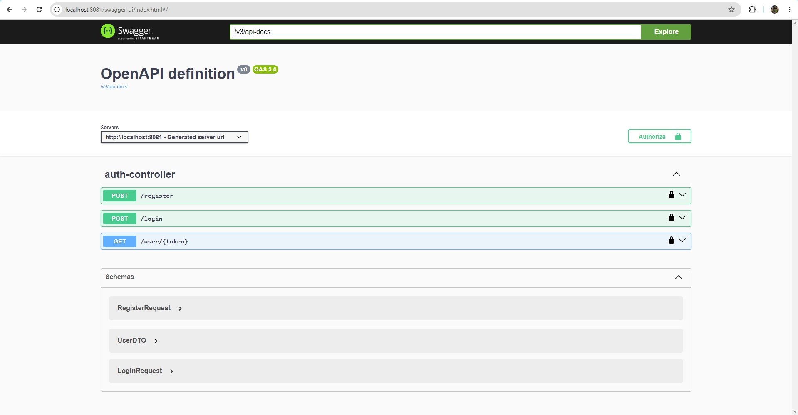
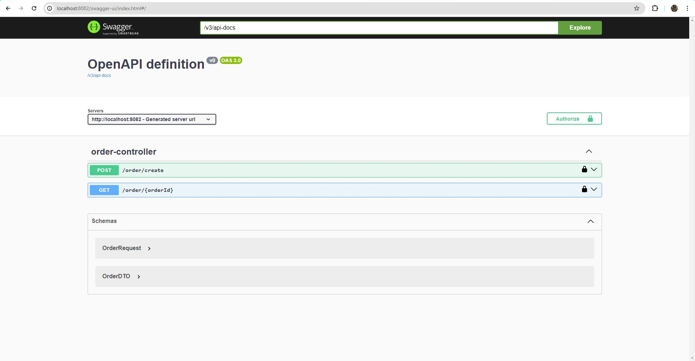

# Ticket Ordering System

КПО ИДЗ Модуль 4. Дадыков Артемий, БПИ225.

## Структура проекта

```zsh
TicketOrderingSystem
├───Auth                                                # Микросервис авторизации пользователей.
│   └───src
│       └───main
│           ├───java
│           │   └───ticketorderingsystem
│           │       └───com
│           │           └───auth
│           │               ├───configs                 # Конфигурации (настройка сваггера).
│           │               ├───controllers             # Контроллеры (конечные точки).
│           │               │   ├───apis                # Интерфейс API.
│           │               │   ├───implementations     # Реализация API.
│           │               │   └───requests            # Запросы к серверу.
│           │               ├───dtos                    # Ответы с сервера.
│           │               ├───handlers                # Обработчики (обработчик ошибок для их корректного вывода).
│           │               ├───models                  # Сущности базы данных.
│           │               ├───repositories            # Слой "Репозиторий" для работы с сущностями.
│           │               ├───services                # Слой "Сервис", отвечающий за бизнес-логику.
│           │               │   ├───implementations     # Реализация сервисов.
│           │               │   └───interfaces          # Интерфейсы сервисов.
│           │               └───utils                   # Вспомогательные объекты.
│           │                   └───validations         # Валидация данных (имён пользователей, почт, паролей).
│           └───resources                               # Ресурсы сервиса (настройки и переменные).
│
├───docs                                                # Документы домашнего задания.                                                
│   └───assignment                                      # Условие домашнего задания.
│
│
└───TicketOrdering                                      # Микросервис заказов на покупку билетов.
    └───src
        └───main
            ├───java
            │   └───ticketorderingsystem
            │       └───com
            │           └───ticketordering
            │               ├───configs                 # Конфигурации (настройка сваггера).
            │               ├───controllers             # Контроллеры (конечные точки).
            │               │   ├───apis                # Интерфейс API.
            │               │   ├───implementations     # Реализация API.
            │               │   └───requests            # Запросы к серверу.
            │               ├───dtos                    # Ответы с сервера.
            │               ├───handlers                # Обработчики (обработчик ошибок для их корректного вывода).
            │               ├───models                  # Сущности базы данных.
            │               │   └───enums               # Вспомогательные enum классы для сущностей.
            │               ├───repositories            # Слой "Репозиторий" для работы с сущностями.
            │               └───services                # Слой "Сервис", отвечающий за бизнес-логику.
            │                   ├───implementations     # Реализация сервисов.
            │                   └───interfaces          # Интерфейсы сервисов.
            └───resources                               # Ресурсы сервиса (настройки и переменные).
```

## Запуск

Запускал на операционной системе `Windows`.

```
docker-compose up -d
```

## Swagger

- [http://localhost:8081/swagger](http://localhost:8081/swagger) - Микросервис авторизации пользователей (Auth Service);
- [http://localhost:8082/swagger](http://localhost:8082/swagger) - Микросервис заказов на покупку билетов (Ticket Ordering Service).




